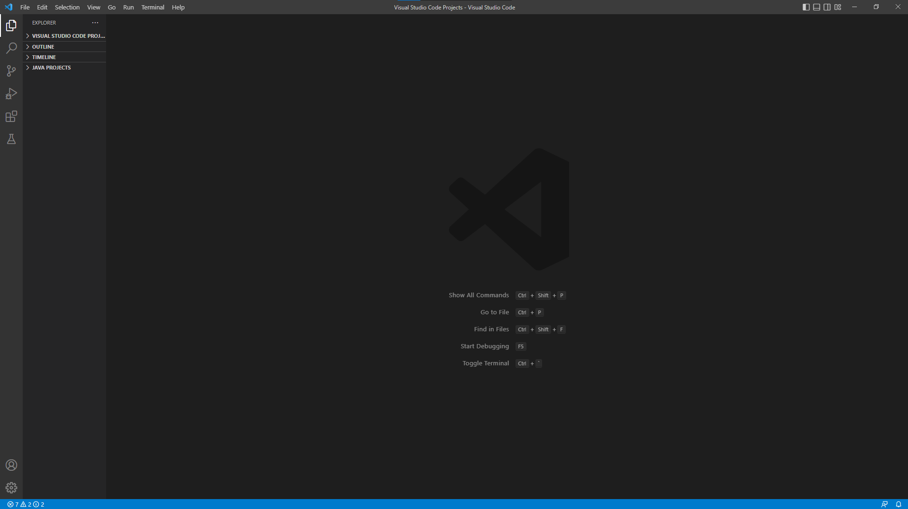
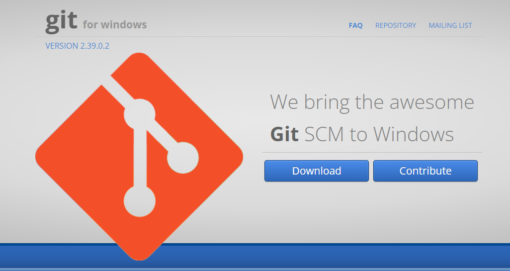
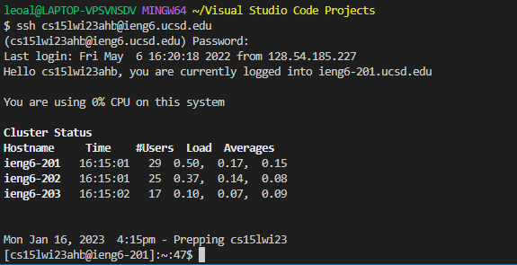
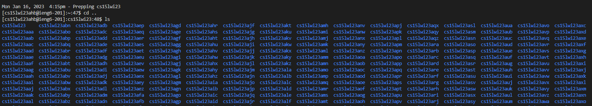

## How to Connect to the Class Server

- [Install VSCode](#step-1)
-------------------
- [Install Git](#step-2)
-----------------------
- [Connect to server](#step-3)
-------------------
- [Try some commands](#step-4) 
-------------------

Step 1
------
To install VSCode simply go to https://code.visualstudio.com/ and follow the website directions. 
After the install is complete, open VSCode on your computer and you should see something like this:

Step 2
------
After you've installed VSCode, go to https://gitforwindows.org/ and follow the directions of the website to install Git. 
This program will allow you to use the bash terminal and remotely access a server.

Step 3
------
After Git is installed, follow the instructions in this [post](https://stackoverflow.com/questions/42606837/how-do-i-use-bash-on-windows-from-the-visual-studio-code-integrated-terminal/50527994#50527994) to install the Bash terminal.
Then, open the VSCode terminal by clicking and holding "Ctrl" + "Shift" + "`" and insert the following:
"ssh cs15lwi23zz@ieng6.ucsd.edu" 
Make sure to substitute "zz" with the last three letters of your @ieng username.
Enter your password when prompted.

(Your username and password can be found in this [link](https://sdacs.ucsd.edu/~icc/index.php))
You should see a message like this when connection is stablished:

Step 4
------
Finally, try some commands on this [list](https://blackdeath12.github.io/cse15l-lab-reports/commands-list.html) and check that everything is working correctly. 
To logout, type "exit" or use "Ctrl + D"

cd {directory}: change your current working directory for a different one.
cd ~: go to the main directory.
ls: list the files inside the working directory.
ls {directory}: list the files inside a specified directory.
cp {directory}: copy a file.
cat {directory}: reads the directory's contents and returns it as output.

