## How to Connect to the Class Server

- [Install VSCode](#step-1)
-------------------
- [Install Git](#step-2)
-----------------------
- [Connect to server](#step-3)
-------------------
- [Try some commands](#step-4) 
-------------------

## Servers and Bugs (Week 3)
- [String Server](#part1)
--------------------------
- [Bugs](#part2)
-----------------

## Researching Commands (Week 5)
- [grep](#Researching)

Step 1
------
To install VSCode simply go [here](https://code.visualstudio.com/) and follow the website directions. 
After the install is complete, open VSCode on your computer and you should see something like this:


Step 2
------
After you've installed VSCode, go to [Git](https://gitforwindows.org/) and follow the directions of the website to install Git. 
This program will allow you to use the bash terminal and remotely access a server.


Step 3
------
After Git is installed, follow the instructions in this [post](https://stackoverflow.com/questions/42606837/how-do-i-use-bash-on-windows-from-the-visual-studio-code-integrated-terminal/50527994#50527994) to install the Bash terminal.
Then, open the VSCode terminal by clicking and holding "Ctrl" + "Shift" + "`" and insert the following:
"ssh cs15lwi23zz@ieng6.ucsd.edu" 
Make sure to substitute "zz" with the last three letters of your @ieng username.
Enter your password when prompted.

(Your username and password can be found in this [link](https://sdacs.ucsd.edu/~icc/index.php))
You should see a message like this when connection is stablished:


Step 4
------
Finally, try some commands on this [list](https://blackdeath12.github.io/cse15l-lab-reports/commands-list.html) and check that everything is working correctly. 
To logout, type "exit" or use "Ctrl + D"


cd {directory}: change your current working directory for a different one.

cd ..: will go back one directory, e.g. /home/kitchen/door will go to /home/kitchen after running cd ..

cd ~: go to the main directory.

ls: list the files inside the working directory.

ls -a: will list all files, including hidden files. 

ls {directory}: list the files inside a specified directory.

cp {directory}: copy a file.

cat {directory}: reads the directory's contents and returns it as output.


## Servers and Bugs (Week 3)


Part 1
------

Code for the server:

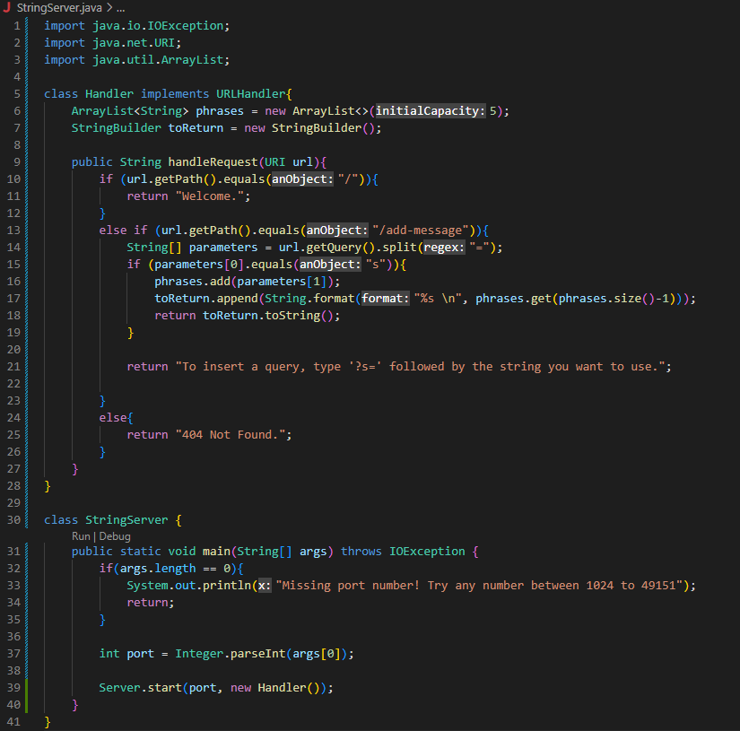

In this first image we enter the if-section of the code that deals with the path "add-messages". After the query is written, the server seperates the string inside the search box, splits it on every "=" sign, and stores the parameters inside an array. After that, the parameters are appendend into a formated string which is later returned as output. 

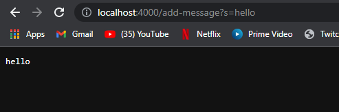

After the second query is made, the new phrase is appended in the array similarly to the first one. Then, the last element in the array is again appended into the formated string and returned as output. 

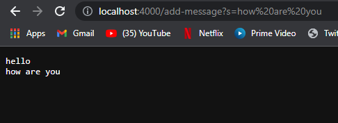

For both examples, the method handleRequest is called, along with the getQuery(), split(), equals(), add(), append(), format(), and toString() methods that help comparing, storing, and returning the strings. The most relevant argument for the handleRequest() method is the url written by the user, which helps the server decide what section of code it will be using. After that, the method .getQuery().split() get the input from the user and split in between "=" for easier management. 
For both examples, after the query is given, the StringBuilder and ArrayList are updated. The array is given a new item to store and the string is mutated into the collection of all the items inside array using the specified "\n" format.


Part 2
-------
Failure-inducing input for buggy program: 

```
 @Test
  public void averageWithoutLowestTest4(){
    double[] input = {5.0,6.0,5.0,5.0};
    double result = ArrayExamples2.averageWithoutLowest(input);
    assertEquals(6.0, result, 0.1);
  } 
```

Input that doesn't induce a failure for buggy program:

```
  @Test
  public void averageWithoutLowestTest4(){
    double[] input = {1.0,6.0,5.0,5.0};
    double result = ArrayExamples2.averageWithoutLowest(input);
    assertEquals(5.3, result, 0.1);
  } 
```

Output for failure input:

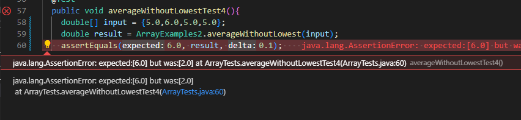

Output for non-failure input:

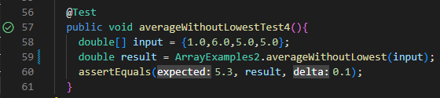

Before:
```
static double averageWithoutLowest(double[] arr) {
      if(arr.length < 2) { return 0.0; }
      double lowest = arr[0];
      for(double num: arr) {
        if(num < lowest) { lowest = num; }
      }
      double sum = 0;
      for(double num: arr) {
        if(num != lowest) { sum += num; }
      }
      return sum / (arr.length - 1);
    }
```

After:
```
static double averageWithoutLowest(double[] arr) {
    if(arr.length < 2) { return 0.0; }
    double lowest = arr[0];
    for(double num: arr) {
      if(num < lowest) { lowest = num; }
    }
    double sum = 0;
    int numbersEliminated = 0;
    for(double num: arr) {
      if(num == lowest){
        numbersEliminated++;
      }
      if(num != lowest) { sum += num; }

    }
    return sum / (arr.length - numbersEliminated);
  }
```

The problem with the code from before was that it failed to consider the possibility of multiple numbers being the lowest. Therefore, it calculated the average as if only one element was removed, when in reality there were multiple numbers ignored. To fix the bug, we simply added a counter for numbers eliminated and substracted that number to the total number of elements in the array (arr.length). 

Part 3
------

I've learned multiple things during week 2 and 3. Firstly, I didn't know how to make a local or external server using java, I've had only used GoogleCloud before. In addition, I didn't know what exactly a query was and how a server could respond to one. Secondly, I've gained a better understanding on how to use JUnit tests and how they can be useful to debugging. 

## Researching Commands (Week 5)

- Command: grep

"-i"
----

```
$ grep -i "Places" Kauffman/*

Kauffman/ch1.txt:The considerations above led to the role of Maxwell’s demon, one of the major places in physics where matter...

```

```
$ grep "Places" Kauffman/*

...

```

Option "-i" allows the grep command to ignore the difference between upper and lower-cases, which can be seen in the examples above where the same pattern returns different results.

"-r"
---
```
$ grep -r "dinosaur" non-fiction

non-fiction/OUP/Berk/CH4.txt:blossoming of sociodramatic play: 3 to 5 years.  The mid- to late-preschool years are a time of burgeoning capacity for sociodramatic play, especially group pretend. Children incorporate more detail into their play themes and benefit from increasingly varied and flexible props—hand and finger puppets; dolls with articulated limbs that can be manipulated; doll clothing with buttons, zippers, and other fasteners; more housekeeping accessories, such as high chairs, bassinets, and cooking, serving, and washing equipment; and diverse play animals, including fish, reptiles, dinosaurs, and exotic species.

```
```
$ grep -r "reptile" written_2

written_2/travel_guides/berlitz1/WhatToJamaica.txt:        basking reptiles and native birds that call this place home. Roots,
written_2/travel_guides/berlitz1/WhereToLosAngeles.txt:        harbors more than 400 different species of animals, birds and reptiles,
written_2/travel_guides/berlitz1/WhereToMalaysia.txt:        varieties of fungi, 262 species of bird, 50 species of reptiles, and
```
Option "-r"tells the command to search for the patter recursively inside the folder, which means it will look up all the data and sub-folders inside the main folder.

"-c"
---
```
$ grep -rc "Lucayans" written_2/
...
written_2/travel_guides/berlitz2/Amsterdam-WhatToDo.txt:0
written_2/travel_guides/berlitz2/Amsterdam-WhereToGo.txt:0
written_2/travel_guides/berlitz2/Athens-History.txt:0
written_2/travel_guides/berlitz2/Athens-Intro.txt:0
written_2/travel_guides/berlitz2/Athens-WhatToDo.txt:0
written_2/travel_guides/berlitz2/Athens-WhereToGo.txt:0
written_2/travel_guides/berlitz2/Bahamas-History.txt:2
...
```
```
$ grep -rc "places" written_2/

written_2/non-fiction/OUP/Abernathy/ch1.txt:2
written_2/non-fiction/OUP/Abernathy/ch14.txt:0
written_2/non-fiction/OUP/Abernathy/ch15.txt:6
written_2/non-fiction/OUP/Abernathy/ch2.txt:3
written_2/non-fiction/OUP/Abernathy/ch3.txt:1
written_2/non-fiction/OUP/Abernathy/ch6.txt:1
written_2/non-fiction/OUP/Abernathy/ch7.txt:2
```
Option "-c" counts the amount of times the pattern was found inside each file that was looked into. (-r is also being used to look recursively inside each folder).

"-n"
----
```
$ grep -rn "places" written_2/
written_2/non-fiction/OUP/Abernathy/ch1.txt:16:When Bond Stores had customers lining up around the block to buy suits, “casual wear,” as we know it today, did not exist. Even in the 1960s, men wore suits, ties, and hats to the ballpark, and women were clothed in dresses and millinery...

//line 16
```
```
$ grep -rn "home" written_2/

written_2/travel_guides/berlitz2/Vallarta-WhereToGo.txt:136:Chahúe Bay lies between Tangolunda and Santa Cruz bays, and is the next to be slated for development. For now, it is home to a few 
beach clubs used by non-oceanfront hotels, and a small marina that is under construction. 

//line 136
```
Option "-n" prints the number of the line in which the pattern was found along with the text on the line. 

For source, click on this [link](https://chat.openai.com/chat)


# Week 7 (Competition)

step -4: <`up-key`> ("ssh cs15lwi23ahb@ieng6.ucsd.edu" was already in my command history: logs into remote computer) <`enter`>
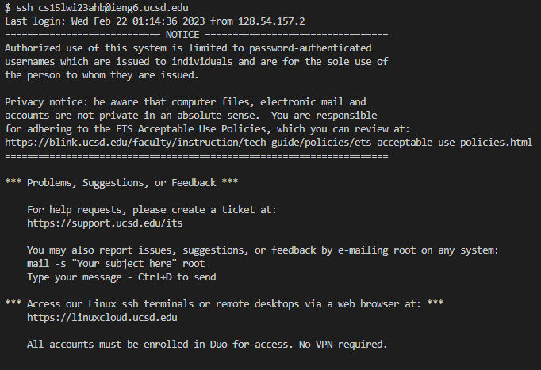
 
step -5: <`Ctrl -c`> git clone <`Ctrl -v` (git@github.com:BlackDeath12/lab7.git)> (copied ssh link of repository) <`enter`>
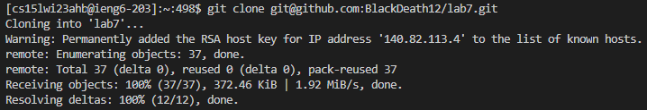
 
step -6: cd l <`Tab`> <`enter`> (changed directory to lab7/), <`Ctrl -c`> <`Ctrl -v`(copied and pasted javac -cp .:lib/hamcrest-core-1.3.jar:lib/junit-4.13.2.jar *.java from notes on computer: compiles java files and junit library)> <`enter`>, <`Ctrl -c`> <`Ctrl -v`(java -cp .:lib/hamcrest-core-1.3.jar:lib/junit-4.13.2.jar org.junit.runner.JUnitCore ListExamplesTests> (runs JUnit tests) <`enter`>
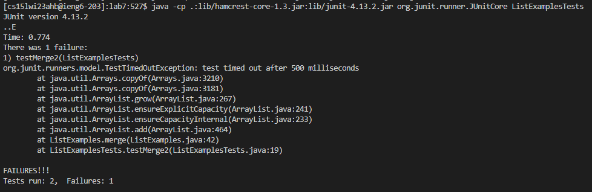
 
step -7: nano Lis <`Tab`>.java (opens file editor for ListExamples.java), <`enter`> <`down`>*43 <`right`>*5 <`delete`> 2 <`Ctrl -o`> <`enter`> <`Ctrl -x`>, <`up-key`> <`up-key`> (re-compile tests)
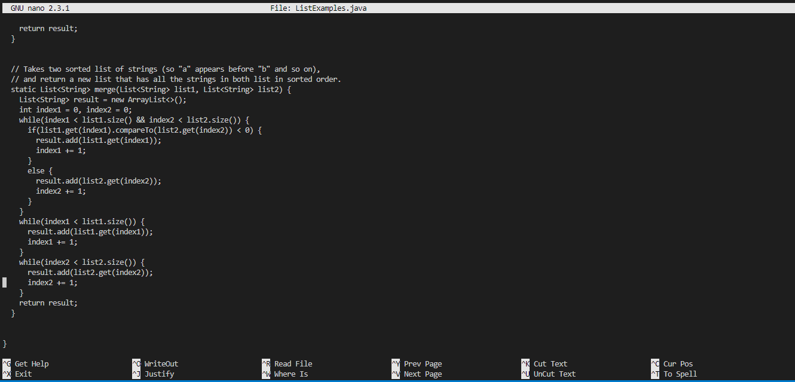
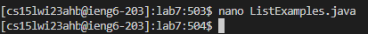
 
step -8: <`up-key`> <`up-key`> <`enter`> (execute command to run tests again)
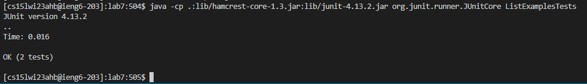
 
step -9: git add Lis <`Tab`>.java <`enter`>, git commit -m "edit" <`enter`>, git push <`enter`>
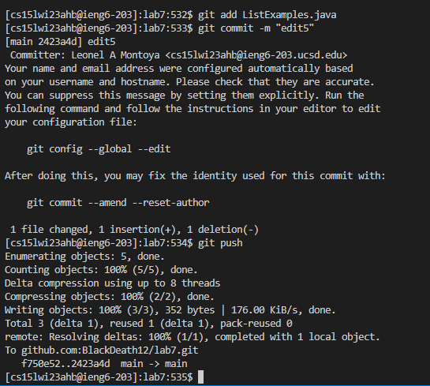

