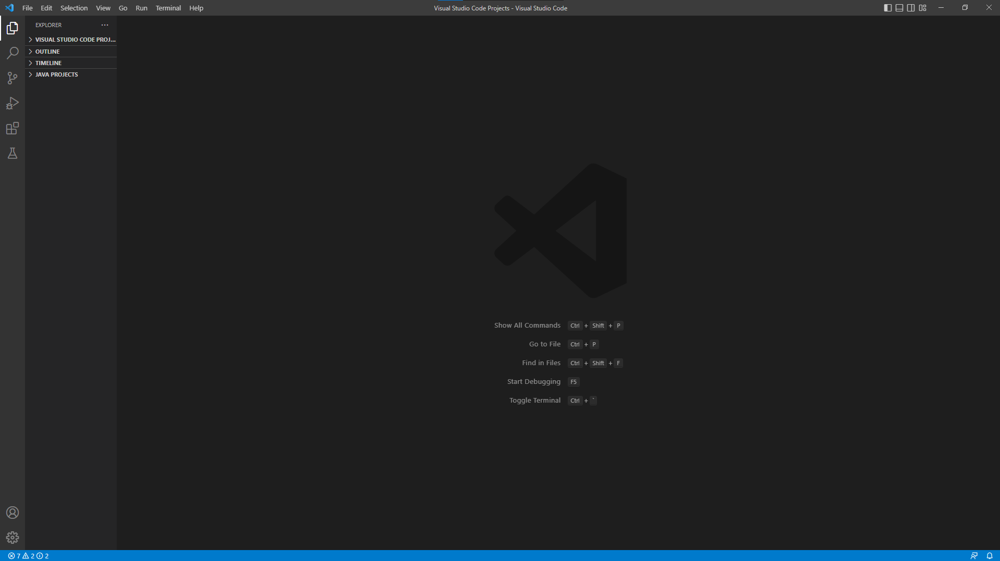

To install VSCode simply go to  https://code.visualstudio.com/ and follow the website directions. 
After the install is complete, open VSCode on your computer and you should see something like this:
 
